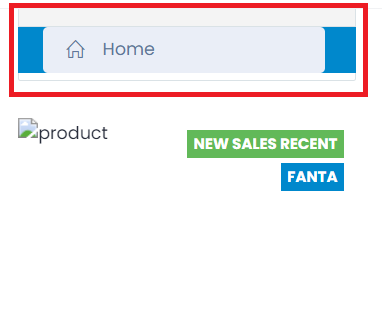
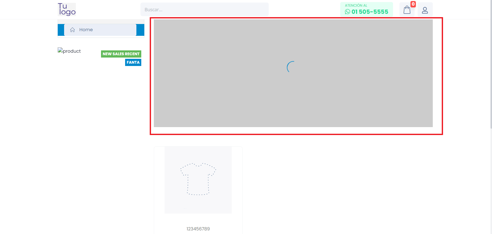
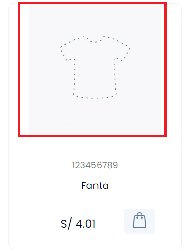
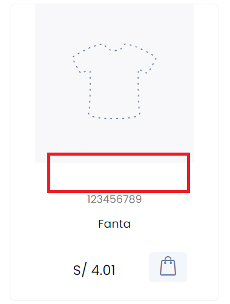
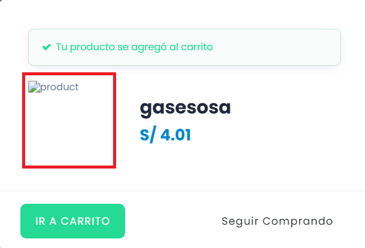

# Cuerpo de Página

En este apartado documentaremos todos los errores encontrados en el cuerpo de ña página **(body)** en la Tienda Virtual.

## **1. SideBar en el Cuerpo de la Tienda**

El SideBar presenta un diseño defectuoso que afecta la estética general de la tienda.

---

## **2. Icono de Productos**

El icono asociado a la sección **"Product"** no se carga correctamente.

---

## **3. Imagen en el Cuerpo de la Tienda**

La imagen principal del cuerpo de la tienda no se carga adecuadamente o está **ausente**.

---

## **4. Problemas con el Producto en la Página**

### **4.1. Error en la Imagen del Producto**

La imagen del producto no se **visualiza** correctamente.

### **4.2. Botón de Vista Rápida No Visible**

El botón de vista rápida no es **visible** para los usuarios debido a un problema con el color de fondo.

### **4.3. Problema al Cargar la Imagen del Producto en Vista Rápida**

La imagen del producto **no se carga** correctamente al acceder a la vista rápida.

-----------------------------------------------------------
*Para solucionar estos problemas, se recomienda revisar y ajustar el diseño y la funcionalidad correspondientes que esta documentado en la seccion de mejoras.*