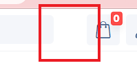
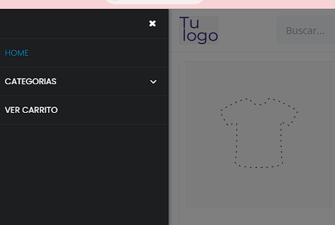
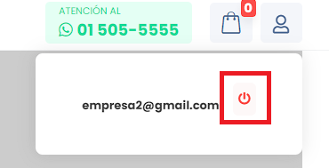
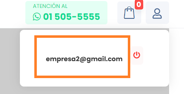

# Encabezado

En este apartado documentaremos todos los errores encontrados en el Encabezado **(header)** en la Tienda Virtual.

## **1. Logo**

- [ ] **Tarea pendiente**

El logo se visualiza con un fondo gris, lo que puede afectar su **visibilidad** y en diseño al usuario.

## **2. Menú**

- [ ] **Tarea pendiente**

Cuando el tamaño de la página web **se reduce**, el icono del menú **no es visible** debido a su color blanco, que se confunde con el fondo del encabezado.

- **Menú abierto**

## **3. Usuario**

- [ ] **Tarea pendiente**

El icono de **"cerrar sesión"** en la sección de usuario es demasiado pequeño y tiene un fondo gris, lo que **dificulta su visualización** y no se adecúa correctamente a la estética de una tienda virtual. Además, el ícono utilizado no es el más apropiado para representar la función de **"cerrar sesión"**.

Además, el correo electrónico que se muestra junto al icono está mal posicionado, lo que afecta la presentación general de la sección.

-----------------------------------------------------------
*Para solucionar estos problemas, se recomienda revisar y ajustar el diseño y la funcionalidad correspondientes que esta documentado en la seccion de mejoras.*