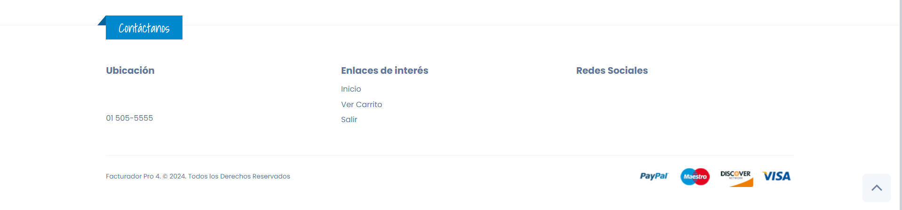
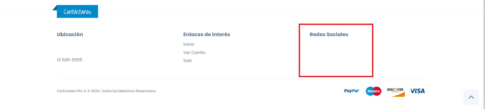

# Pie de Página

En este apartado documentaremos todos los errores encontrados en el pie de página **(footer)** en la Tienda Virtual.

## **Primer Error Encontrado**

Como primer error encontrado tenemos al pie de página que es del **mismo color** que el **fondo de la página**, lo que hace que no se distinga y se pierda entre los elementos de la página.

## **Segundo Error Encontrado**

Como segundo error encontrado tenemos a los elementos del pie de página, algunos están con el color del fondo e incluso el **color de la página**, lo que hace que estos colores **no sean visibles** para el cliente.

## **Tercer Error Encontrado**

Como tercer error encontrado tenemos el apartado de redes sociales que está **vacío**. No podemos poner elementos en el pie de página que estén vacíos, incluso si son importantes, se deben llenar y no dejarlos en blanco.

## **Cuarto Error Encontrado**

Como cuarto error encontrado tenemos a los elementos que tienen animación de **"Hover"** en CSS. En este caso, la animación que se hace es cambiarle de color; el problema está en que este color al que cambia la letra es del mismo color del fondo, lo que hace que la letra se **pierda** y no se llegue a entender del todo.

-----------------------------------------------------------
*Para solucionar estos problemas, se recomienda revisar y ajustar el diseño y la funcionalidad correspondientes que esta documentado en la seccion de mejoras.*